# 配置目标
在VS2019中添加Qt工具，在Qt界面中借助VTK显示3D点云。首先贴出我的电脑的相关信息：

<div align=center>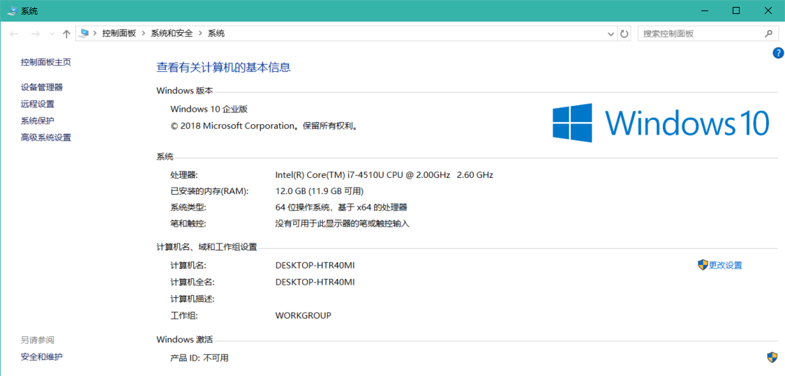</div>

# 配置步骤

## VS2019安装
1. 首先下载Visual Studio Installer，选择社区版：[下载链接](https://visualstudio.microsoft.com/zh-hans/vs/)

2. 双击打开安装程序，勾选使用C++的桌面开发，如有需要请注意更改安装目录

## Qt安装
1. 首先去 http://download.qt.io/archive/qt/ 下载qt安装程序，目前（2020.05.18）最新版本为5.14.2，选择qt-opensource-windows-x86-5.14.2.exe下载

<div align=center>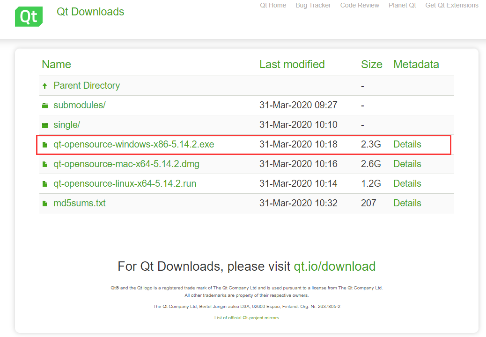</div>

2. 下载完成之后双击安装，其中安装组件勾选MSVC 2017 64-bit

<div align=center>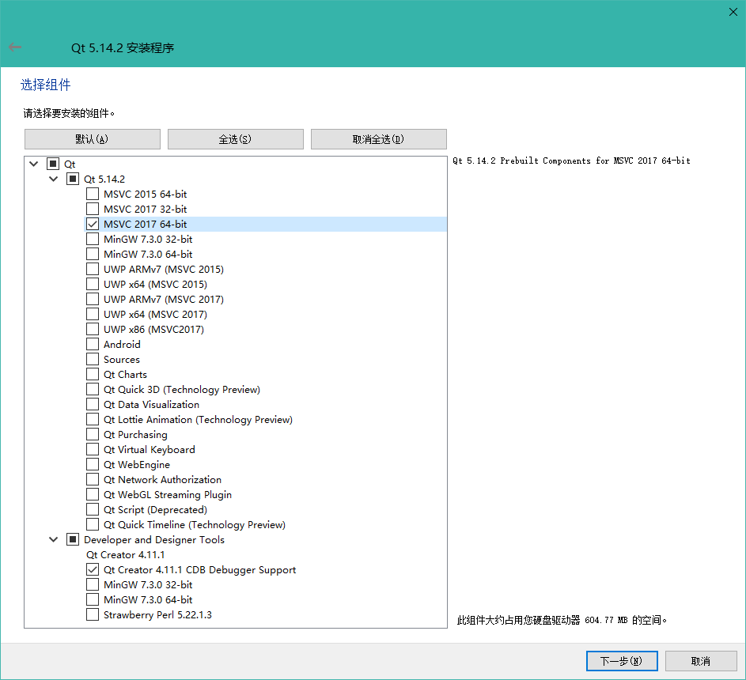</div>

3. 确认和添加环境变量

|  变量名   | 变量值  |
|  :----:  | :----:  |
| Path  | I:\PCL_MSVC2019\Qt5.14.2\5.14.2\msvc2017_64\bin |

## VS2019中添加Qt配置
1. 启动VS2019，如需登录，可跳过，并选择“继续但无需代码”来启动

<div align=center>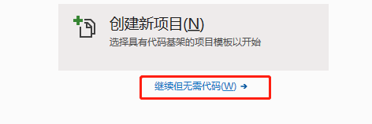</div>

2. 从菜单栏依次点击“扩展->管理扩展”，打开界面后，先点联机，在输入框搜索Qt，选择Qt Visual Studio Tools下载安装

<div align=center>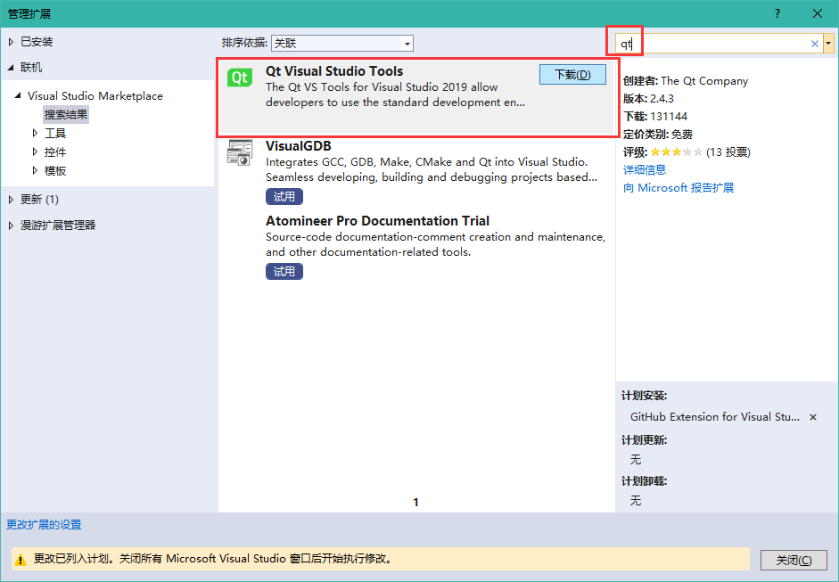</div>

3. 关闭VS2019并重新打开，期间会自动执行相关配置的设置。按照下图点开扩展中的Qt Options

<div align=center>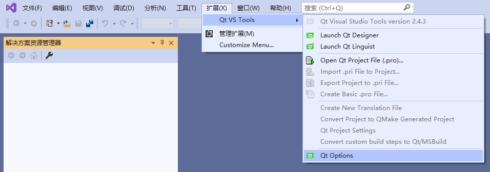</div>

弹出下方界面后，按下图顺序点击添加，添加的是在第2节安装的Qt的msvc2017_64目录：

<div align=center>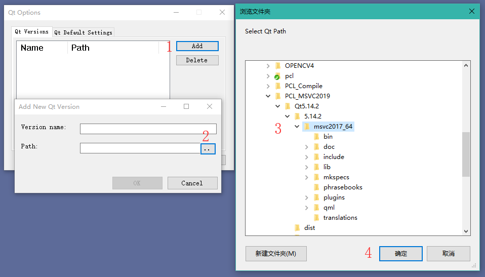</div>

添加完成之后可以设置默认使用的编译器，OK保存

<div align=center>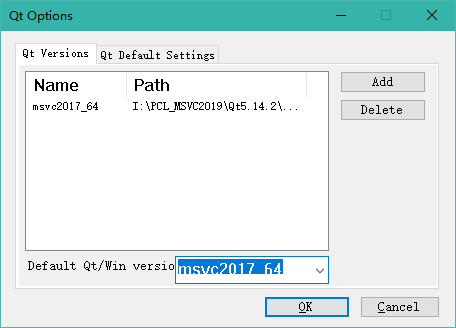</div>

## VTK的编译安装

1.  在https://vtk.org/download/下载8.2版的源码：

<div align=center></div>

2. 新建同级的source文件夹，build文件夹和msvc2019_46文件夹，将源码解压在source文件夹里

<div align=center>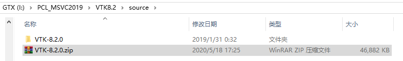</div>

3. 在cmake官网https://cmake.org/download/下载最新版的win版cmake

<div align=center>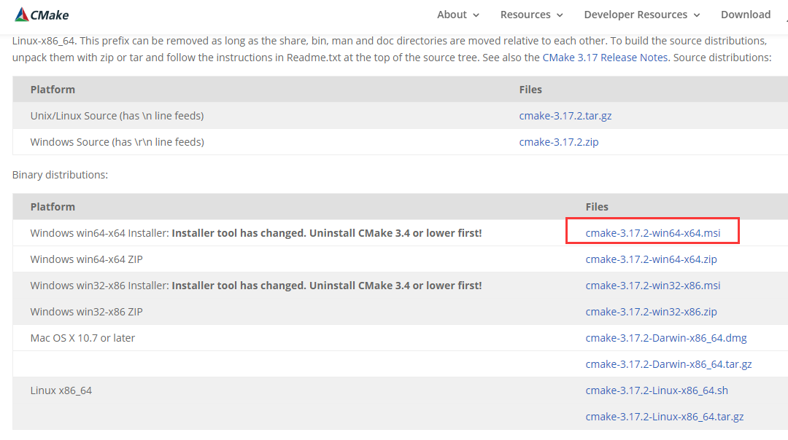</div>

4. 以管理员身份运行刚刚安装的cmake，设置源码路径和构建路径，点击Configure，选择VS2019，点击Finish开始构建

<div align=center>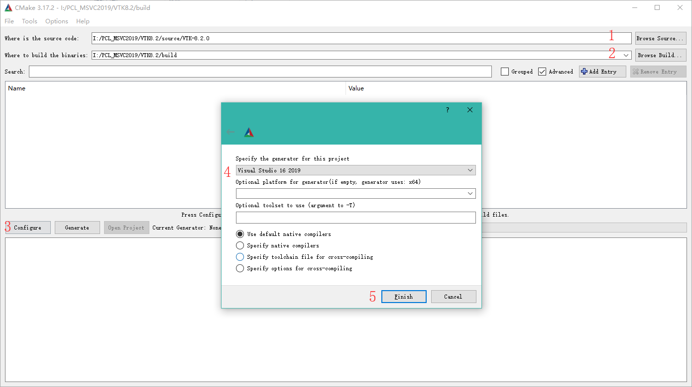</div>

5. 之后我们对下面的构建项进行修改：

- BUILD_SHARED_LIBS确认勾选了，这样才能生成dll和lib

<div align=center>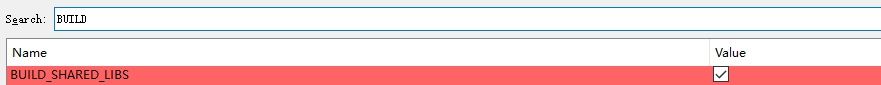</div>

- 和Qt相关的选择YES

<div align=center>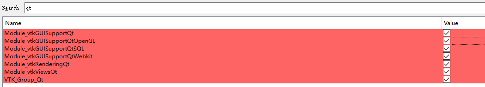</div>

点击Configure之后确认Qt的相关文件夹选择正确：

<div align=center></div>

- CMAKE_INSTALL_PREFIX，更改默认的安装目录

<div align=center>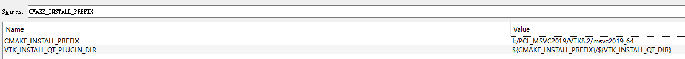</div>

- 增加CMAKE_DEBUG_POSTFIX，Debug版生成的链接库会在名字末尾加d以使和Release版的进行区分

<div align=center>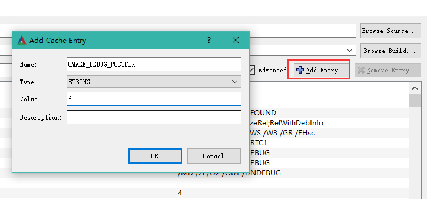</div>

点击Configure，没有红色之后，点击Generate，之后点击Open Project用VS2019打开VTK配置项目

6. 打开VTK配置项目之后

<div align=center>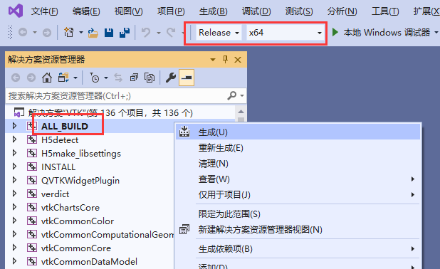</div>

选择Release,x64，右键ALL_BUILD，点击生成，之后进入一定时间的编译生成

<div align=center>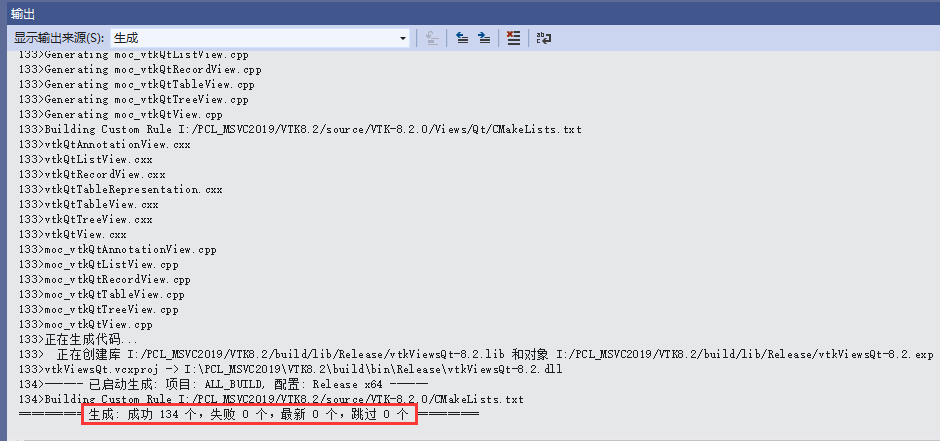</div>

全部生成成功之后，右键Installl，仅生成Install

<div align=center>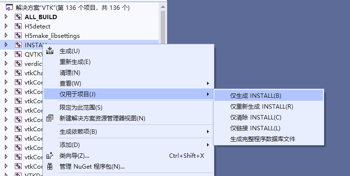</div>

之后就成功安装在指定文件夹：

<div align=center>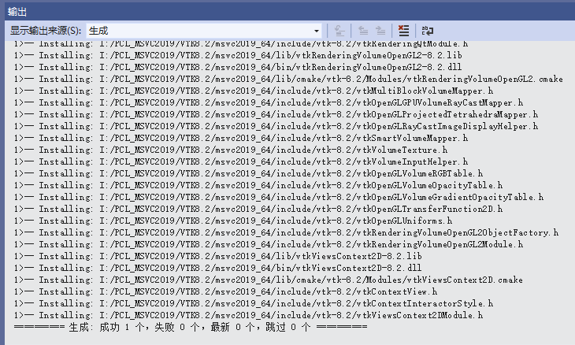</div>

7. 配置环境变量：

|  变量名   | 变量值  |
|  :----:  | :----:  |
| Path  | I:\PCL_MSVC2019\VTK8.2\msvc2019_64\bin |

## PCL安装

首先进入PCL的Release网址下载最新的AllInOne库，目前（2020.05.18）最新的版本为1.11.0，选择PCL-1.11.0-AllInOne-msvc2019-win64.exe下载

<div align=center>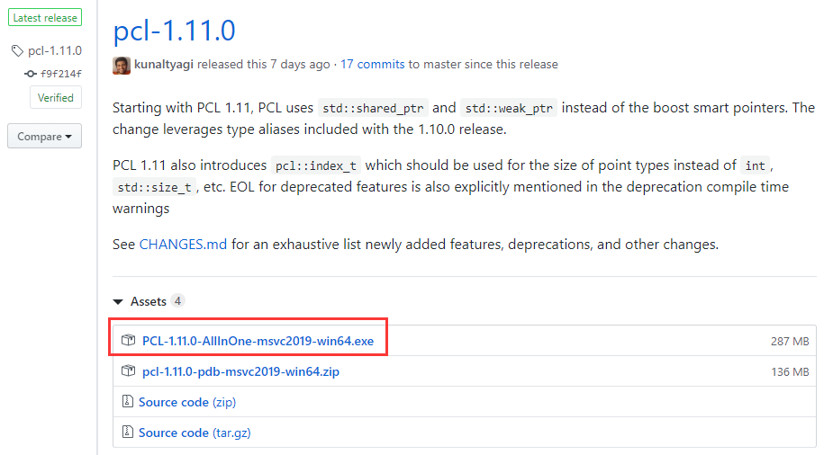</div>

下载完成之后双击安装，注意其中的几个选择：

- 选择添加PCL的相关库到环境变量中：

<div align=center>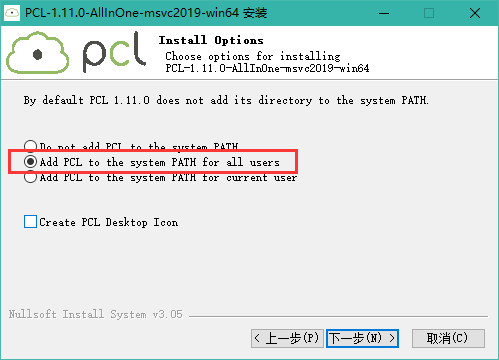</div>

- 不勾选VTK，我们已经自行编译

<div align=center>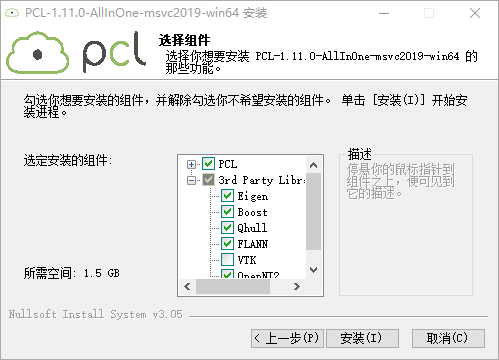</div>

安装完成之后，我们在安装文件夹里可以如下的目录结构：

<div align=center>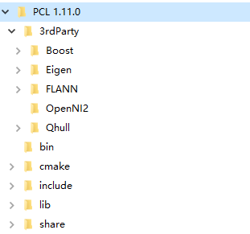</div>

之后在环境变量中查看，确认我们已经将PCL添加到环境变量，即：

|  变量名   | 变量值  |
|  :----:  | :----:  |
| Path  | I:\PCL_MSVC2019\PCL 1.11.0\bin |

## Opencv4安装

进入Opencv官网的Release网页，下载最新的Windows的可执行安装程序，目前（2020.05.18）最新的安装版本为4.3.0，如有需要更改解压地址

<div align=center>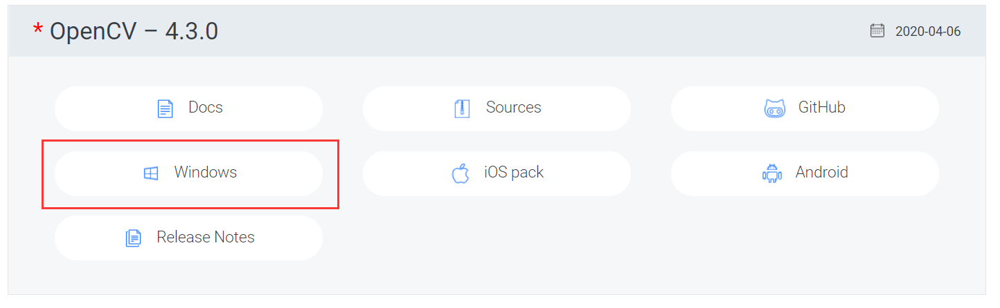</div>

同样，需要添加如下的环境变量：

|  变量名   | 变量值  |
|  :----:  | :----:  |
| Path  | I:\PCL_MSVC2019\opencv\build\x64\vc15\bin |

## 安装测试

通过此步骤验证我们上述环境配置是否正确，首先，检查环境变量是否都已经添加到全局Path变量里，即如下图所示：

<div align=center>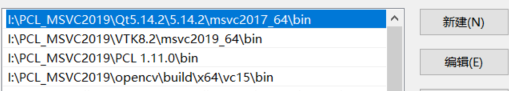</div>

另外，为了防止其他软件如Anaconda的环境变量设置与上述环境变量冲突或者重复，请将上述环境变量置顶。

打开VS2019，选择“创建新项目”，选择“Qt GUI Application”，下一步

<div align=center>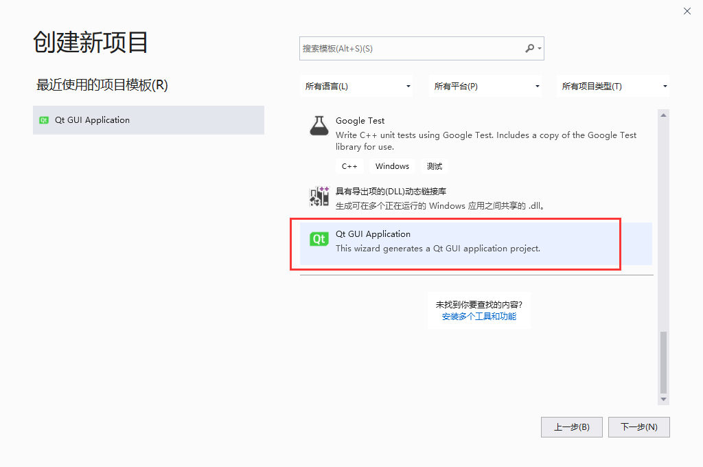</div>

设定项目名称为“QvtkTest”，位置选择桌面，然后创建

<div align=center>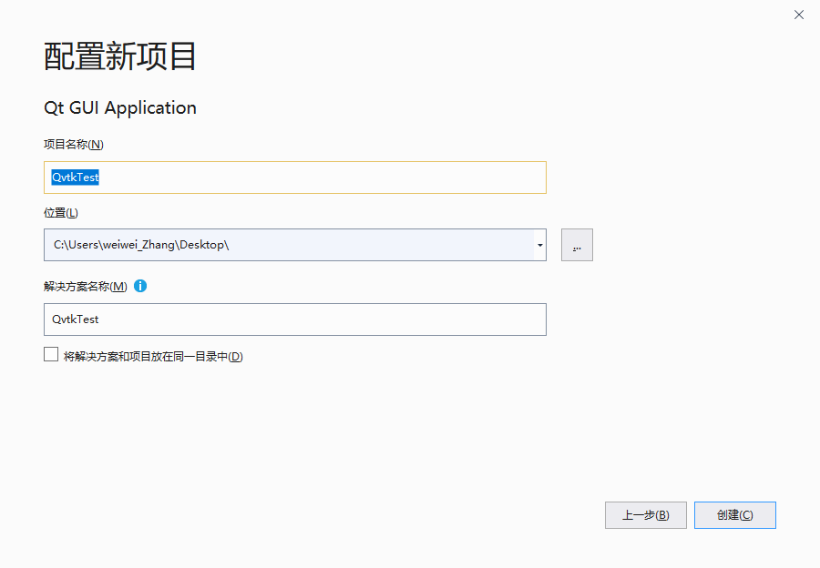</div>

确认是否选择了下面3个模块

<div align=center>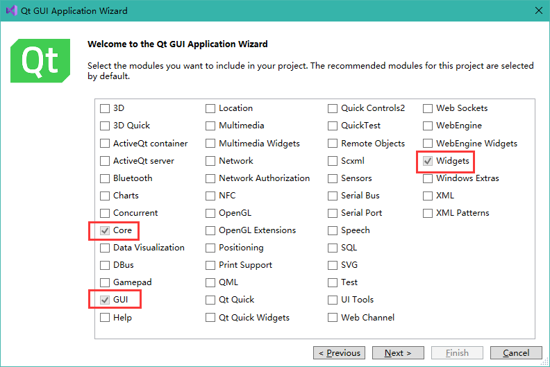</div>

选择QWidget，点击Finish完成项目构建

<div align=center>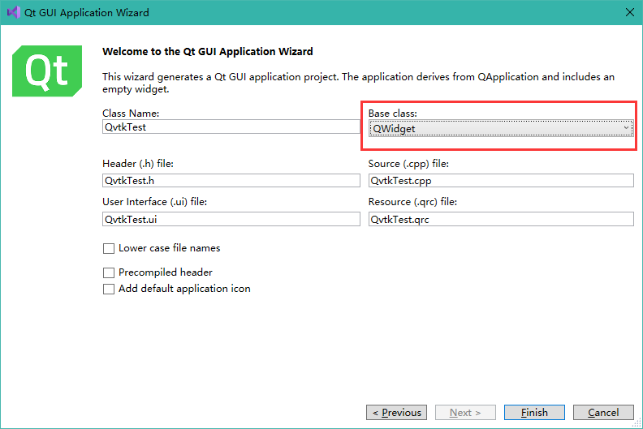</div>

之后，构建了如下的项目，注意选择Release

<div align=center>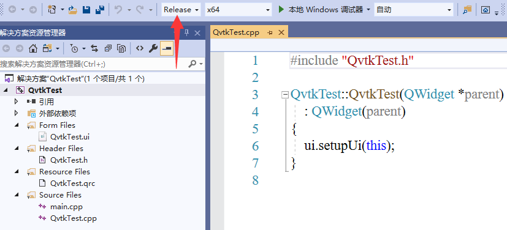</div>

我们首先配置项目环境，点击下方的属性管理器

<div align=center>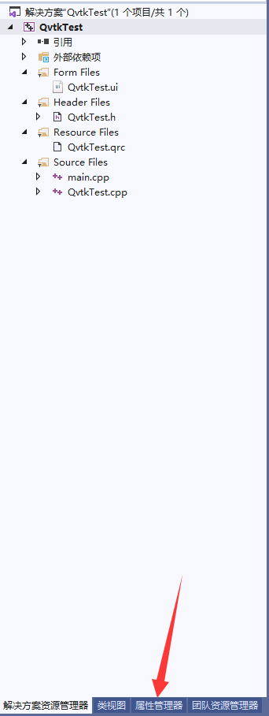</div>

在Release 64下选择添加新项目属性表，命名为msvc2019_64

<div align=center>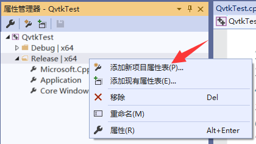</div>

双击新构建的属性表

<div align=center>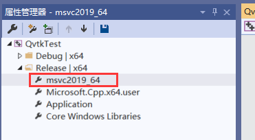</div>

我们一共需要更改3个地方，分别是VC++目录下的包含目录和库目录，还有链接器下的输入

<div align=center>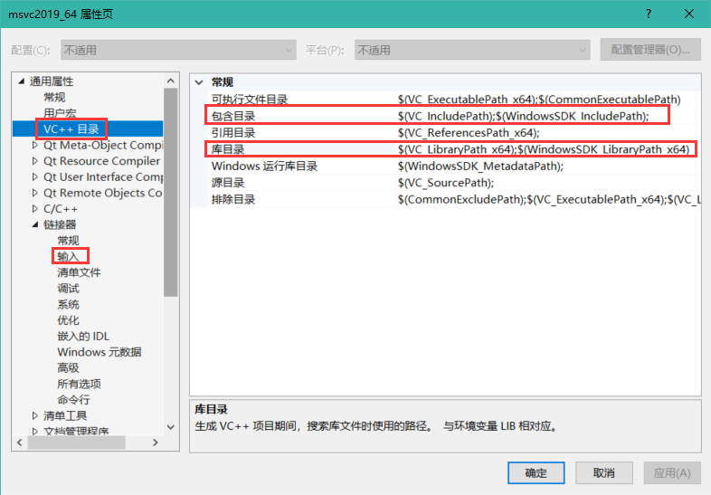</div>

所做的更改如下：

- 包含目录，为各个库的include文件夹

<div align=center>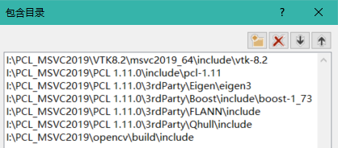</div>

- 库目录，为各个库的lib文件夹

<div align=center>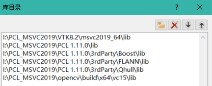</div>

- 链接器输入，各个库的lib文件夹里的所有*.lib文件，这里将其列出：

```
vtkChartsCore-8.2.lib
vtkCommonColor-8.2.lib
vtkCommonComputationalGeometry-8.2.lib
vtkCommonCore-8.2.lib
vtkCommonDataModel-8.2.lib
vtkCommonExecutionModel-8.2.lib
vtkCommonMath-8.2.lib
vtkCommonMisc-8.2.lib
vtkCommonSystem-8.2.lib
vtkCommonTransforms-8.2.lib
vtkDICOMParser-8.2.lib
vtkDomainsChemistry-8.2.lib
vtkDomainsChemistryOpenGL2-8.2.lib
vtkdoubleconversion-8.2.lib
vtkexodusII-8.2.lib
vtkexpat-8.2.lib
vtkFiltersAMR-8.2.lib
vtkFiltersCore-8.2.lib
vtkFiltersExtraction-8.2.lib
vtkFiltersFlowPaths-8.2.lib
vtkFiltersGeneral-8.2.lib
vtkFiltersGeneric-8.2.lib
vtkFiltersGeometry-8.2.lib
vtkFiltersHybrid-8.2.lib
vtkFiltersHyperTree-8.2.lib
vtkFiltersImaging-8.2.lib
vtkFiltersModeling-8.2.lib
vtkFiltersParallel-8.2.lib
vtkFiltersParallelImaging-8.2.lib
vtkFiltersPoints-8.2.lib
vtkFiltersProgrammable-8.2.lib
vtkFiltersSelection-8.2.lib
vtkFiltersSMP-8.2.lib
vtkFiltersSources-8.2.lib
vtkFiltersStatistics-8.2.lib
vtkFiltersTexture-8.2.lib
vtkFiltersTopology-8.2.lib
vtkFiltersVerdict-8.2.lib
vtkfreetype-8.2.lib
vtkGeovisCore-8.2.lib
vtkgl2ps-8.2.lib
vtkglew-8.2.lib
vtkGUISupportQt-8.2.lib
vtkGUISupportQtOpenGL-8.2.lib
vtkGUISupportQtSQL-8.2.lib
vtkhdf5-8.2.lib
vtkhdf5_hl-8.2.lib
vtkImagingColor-8.2.lib
vtkImagingCore-8.2.lib
vtkImagingFourier-8.2.lib
vtkImagingGeneral-8.2.lib
vtkImagingHybrid-8.2.lib
vtkImagingMath-8.2.lib
vtkImagingMorphological-8.2.lib
vtkImagingSources-8.2.lib
vtkImagingStatistics-8.2.lib
vtkImagingStencil-8.2.lib
vtkInfovisCore-8.2.lib
vtkInfovisLayout-8.2.lib
vtkInteractionImage-8.2.lib
vtkInteractionStyle-8.2.lib
vtkInteractionWidgets-8.2.lib
vtkIOAMR-8.2.lib
vtkIOAsynchronous-8.2.lib
vtkIOCityGML-8.2.lib
vtkIOCore-8.2.lib
vtkIOEnSight-8.2.lib
vtkIOExodus-8.2.lib
vtkIOExport-8.2.lib
vtkIOExportOpenGL2-8.2.lib
vtkIOExportPDF-8.2.lib
vtkIOGeometry-8.2.lib
vtkIOImage-8.2.lib
vtkIOImport-8.2.lib
vtkIOInfovis-8.2.lib
vtkIOLegacy-8.2.lib
vtkIOLSDyna-8.2.lib
vtkIOMINC-8.2.lib
vtkIOMovie-8.2.lib
vtkIONetCDF-8.2.lib
vtkIOParallel-8.2.lib
vtkIOParallelXML-8.2.lib
vtkIOPLY-8.2.lib
vtkIOSegY-8.2.lib
vtkIOSQL-8.2.lib
vtkIOTecplotTable-8.2.lib
vtkIOVeraOut-8.2.lib
vtkIOVideo-8.2.lib
vtkIOXML-8.2.lib
vtkIOXMLParser-8.2.lib
vtkjpeg-8.2.lib
vtkjsoncpp-8.2.lib
vtklibharu-8.2.lib
vtklibxml2-8.2.lib
vtklz4-8.2.lib
vtklzma-8.2.lib
vtkmetaio-8.2.lib
vtkNetCDF-8.2.lib
vtkogg-8.2.lib
vtkParallelCore-8.2.lib
vtkpng-8.2.lib
vtkproj-8.2.lib
vtkpugixml-8.2.lib
vtkRenderingAnnotation-8.2.lib
vtkRenderingContext2D-8.2.lib
vtkRenderingContextOpenGL2-8.2.lib
vtkRenderingCore-8.2.lib
vtkRenderingFreeType-8.2.lib
vtkRenderingGL2PSOpenGL2-8.2.lib
vtkRenderingImage-8.2.lib
vtkRenderingLabel-8.2.lib
vtkRenderingLOD-8.2.lib
vtkRenderingOpenGL2-8.2.lib
vtkRenderingQt-8.2.lib
vtkRenderingVolume-8.2.lib
vtkRenderingVolumeOpenGL2-8.2.lib
vtksqlite-8.2.lib
vtksys-8.2.lib
vtktheora-8.2.lib
vtktiff-8.2.lib
vtkverdict-8.2.lib
vtkViewsContext2D-8.2.lib
vtkViewsCore-8.2.lib
vtkViewsInfovis-8.2.lib
vtkViewsQt-8.2.lib
vtkzlib-8.2.lib
pcl_common.lib
pcl_features.lib
pcl_filters.lib
pcl_io.lib
pcl_io_ply.lib
pcl_kdtree.lib
pcl_keypoints.lib
pcl_ml.lib
pcl_octree.lib
pcl_outofcore.lib
pcl_people.lib
pcl_recognition.lib
pcl_registration.lib
pcl_sample_consensus.lib
pcl_search.lib
pcl_segmentation.lib
pcl_stereo.lib
pcl_surface.lib
pcl_tracking.lib
pcl_visualization.lib
opencv_world430.lib
qhullcpp.lib
qhullstatic.lib
qhullstatic_r.lib
```

获取这些lib文件名有一个trick是可以用脚本批量获取，新建一个tree.bat文件，文件内容如下：

<div align=center>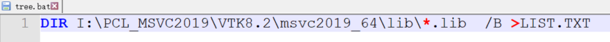</div>

之后双击这个文件，就会在LIST.TXT文件中列出指定文件夹里指定后缀的所有文件名

环境配置完成之后，以后我们新建一个类似的项目，就可以直接将我们构建的项目属性文件msvc2019_64.props（在项目文件夹里）复制到新建的项目文件夹，并导入这个项目属性文件，就可以轻松完成环境配置。

们回到解决方案资源管理器，双击QvtkTest.ui文件，将会用Qt Designer打开这个文件，我们在“Filter”里搜索关键词“Open”，之后将“OpenGL Widget”拉到中间的widget里，右键对象查看器里的QOpenGLWidget，点击“提升为”

<div align=center>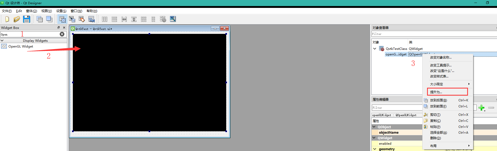</div>

更改“提升的类名称”和“头文件”，选中全局包含，之后选择添加，再点击提升

<div align=center>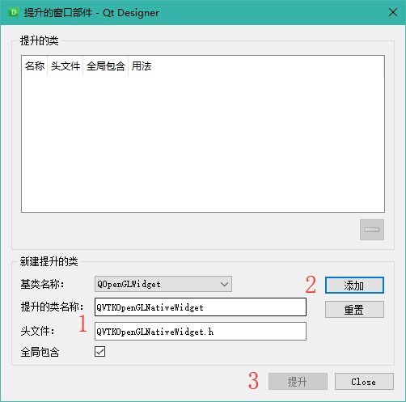</div>

在对象查看器中检测类是否更改，并且注意我们的widget的名称是openGLWidget，之后保存关闭回到VS2019

<div align=center>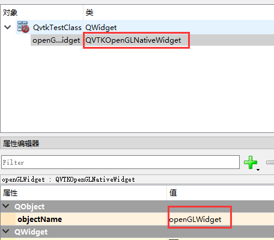</div>

将QvtkTest.h更改为如下内容：

```
#pragma once

#include <pcl/common/common_headers.h>
#include <pcl/point_cloud.h>
#include <pcl/point_types.h>
#include <pcl/visualization/common/common.h>
#include <pcl/visualization/pcl_visualizer.h>
#include <vtkGenericOpenGLRenderWindow.h>

#include <QtWidgets/QWidget>

#include "ui_QvtkTest.h"

class QvtkTest : public QWidget {
  Q_OBJECT

 public:
  QvtkTest(QWidget *parent = Q_NULLPTR);

 protected:
  boost::shared_ptr<pcl::visualization::PCLVisualizer> viewer;

 private:
  Ui::QvtkTestClass ui;
  void initialVtkWidget();
};

```

将QvtkTest.cpp更改为如下内容：

```
#include "QvtkTest.h"

QvtkTest::QvtkTest(QWidget *parent) : QWidget(parent) {
  ui.setupUi(this);
  initialVtkWidget();
  // Create example point cloud
  pcl::PointCloud<pcl::PointXYZRGB>::Ptr point_cloud_ptr(
      new pcl::PointCloud<pcl::PointXYZRGB>);
  std::uint8_t r(255), g(15), b(15);
  for (float z(-1.0); z <= 1.0; z += 0.05) {
    for (float angle(0.0); angle <= 360.0; angle += 5.0) {
      pcl::PointXYZRGB point;
      point.x = 0.5 * std::cos(pcl::deg2rad(angle));
      point.y = sinf(pcl::deg2rad(angle));
      point.z = z;
      std::uint32_t rgb =
          (static_cast<std::uint32_t>(r) << 16 |
           static_cast<std::uint32_t>(g) << 8 | static_cast<std::uint32_t>(b));
      point.rgb = *reinterpret_cast<float *>(&rgb);
      point_cloud_ptr->points.push_back(point);
    }
    if (z < 0.0) {
      r -= 12;
      g += 12;
    } else {
      g -= 12;
      b += 12;
    }
  }
  point_cloud_ptr->width = (int)point_cloud_ptr->points.size();
  point_cloud_ptr->height = 1;
  // Show point cloud in viewer
  viewer->setBackgroundColor(0, 0, 0);
  pcl::visualization::PointCloudColorHandlerRGBField<pcl::PointXYZRGB> rgb(
      point_cloud_ptr);
  viewer->addPointCloud<pcl::PointXYZRGB>(point_cloud_ptr, rgb, "sample cloud");
  viewer->setPointCloudRenderingProperties(
      pcl::visualization::PCL_VISUALIZER_POINT_SIZE, 3, "sample cloud");
  viewer->addCoordinateSystem(1.0);
  viewer->initCameraParameters();
  ui.openGLWidget->update();
}

void QvtkTest::initialVtkWidget() {
  viewer.reset(new pcl::visualization::PCLVisualizer("viewer", false));
  vtkNew<vtkGenericOpenGLRenderWindow> window;
  window->AddRenderer(viewer->getRendererCollection()->GetFirstRenderer());
  ui.openGLWidget->SetRenderWindow(window.Get());
  viewer->setupInteractor(ui.openGLWidget->GetInteractor(),
                          ui.openGLWidget->GetRenderWindow());
  ui.openGLWidget->update();
}
```

运行项目，我们将会看到创建的点云：

<div align=center>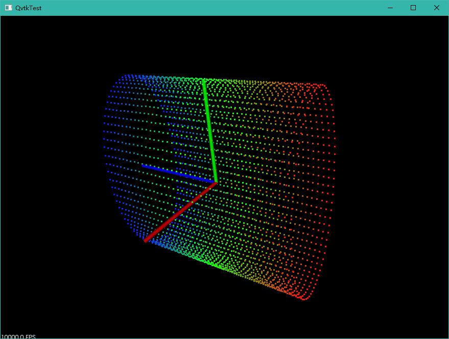</div>

至此，环境搭建完成。
